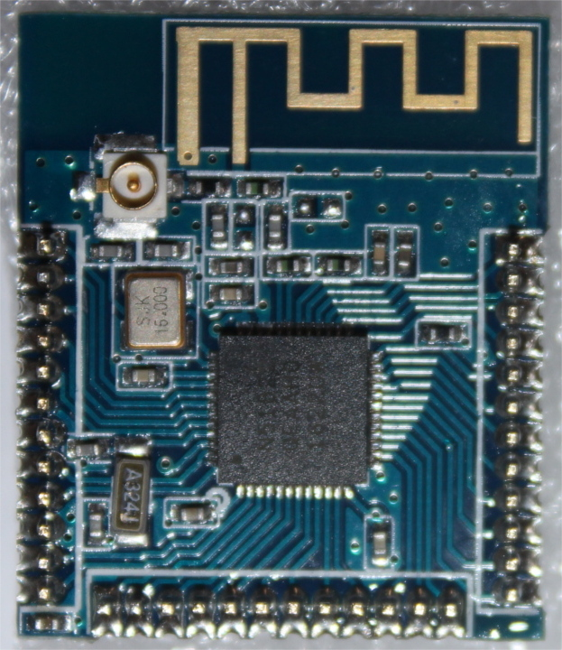

[](https://travis-ci.org/japaric/nrf51822)
[](https://crates.io/crates/nrf51822)
[](https://crates.io/crates/nrf51822)

# `nrf51822`

> A crate to play with this nrf51822 module

<p align="center">

</p>

## First use

The module I got comes pre-flashed with some protected firmware so it's not
possible to re-flash the microcontroller using GDB's `load` command. Therefore,
we must first mass erase the initial firmware to be able to flash the chip
normally.

> **WARNING** This will delete the original firmware

```
$ openocd -f interface/$INTERFACE -f nrf51.cfg

$ telnet 127.0.0.1
> halt
> nrf51 mass_erase
```

## [Documentation](https://docs.rs/nrf51822)

## [Change log](CHANGELOG.md)

## License

Licensed under either of

- Apache License, Version 2.0 ([LICENSE-APACHE](LICENSE-APACHE) or
  http://www.apache.org/licenses/LICENSE-2.0)
- MIT license ([LICENSE-MIT](LICENSE-MIT) or http://opensource.org/licenses/MIT)

at your option.

### Contribution

Unless you explicitly state otherwise, any contribution intentionally submitted
for inclusion in the work by you, as defined in the Apache-2.0 license, shall be
dual licensed as above, without any additional terms or conditions.
